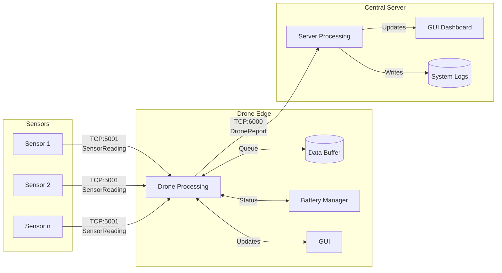
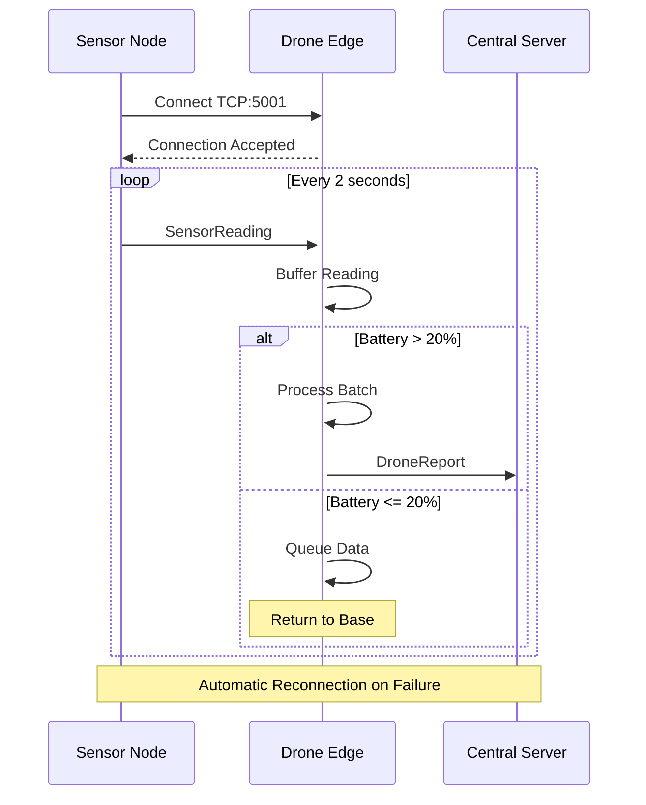
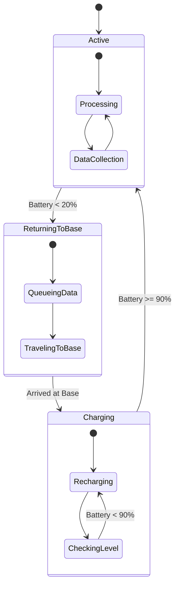
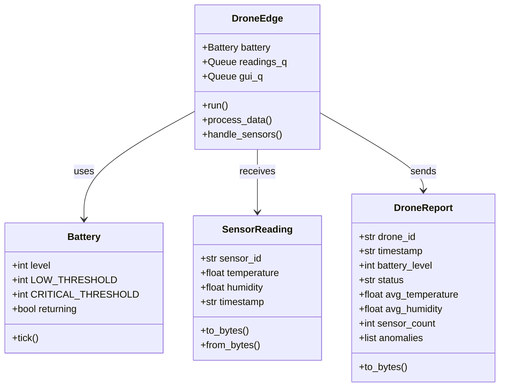
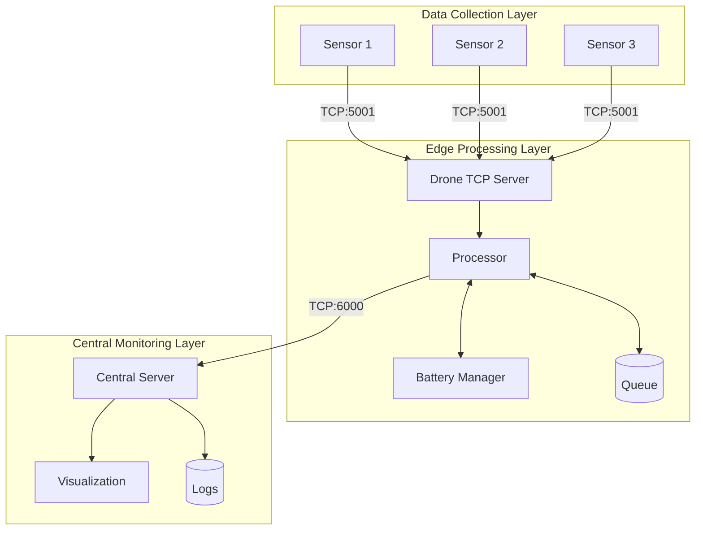

# System Architecture Diagrams

## Component Interaction Diagram

```mermaid
graph LR
    subgraph Sensors
        S1[Sensor 1]
        S2[Sensor 2]
        S3[Sensor n]
    end

    subgraph "Drone Edge"
        D[Drone Processing]
        DB[(Data Buffer)]
        BAT[Battery Manager]
        DG[GUI]
    end

    subgraph "Central Server"
        C[Server Processing]
        CG[GUI Dashboard]
        L[(System Logs)]
    end

    S1 -->|TCP:5001\nSensorReading| D
    S2 -->|TCP:5001\nSensorReading| D
    S3 -->|TCP:5001\nSensorReading| D
    
    D <-->|Queue| DB
    D <-->|Status| BAT
    D <-->|Updates| DG
    
    D -->|TCP:6000\nDroneReport| C
    C -->|Updates| CG
    C -->|Writes| L
```

## Data Flow Diagram

```mermaid
sequenceDiagram
    participant S as Sensor Node
    participant D as Drone Edge
    participant C as Central Server

    S->>D: Connect TCP:5001
    activate D
    D-->>S: Connection Accepted
    
    loop Every 2 seconds
        S->>D: SensorReading
        D->>D: Buffer Reading
        
        alt Battery > 20%
            D->>D: Process Batch
            D->>C: DroneReport
        else Battery <= 20%
            D->>D: Queue Data
            Note over D: Return to Base
        end
    end
    
    Note over S,C: Automatic Reconnection on Failure
```

## State Diagram

```mermaid
stateDiagram-v2
    [*] --> Active
    
    state Active {
        [*] --> Processing
        Processing --> DataCollection
        DataCollection --> Processing
    }
    
    Active --> ReturningToBase: Battery < 20%
    ReturningToBase --> Charging: Arrived at Base
    Charging --> Active: Battery >= 90%
    
    state ReturningToBase {
        [*] --> QueueingData
        QueueingData --> TravelingToBase
    }
    
    state Charging {
        [*] --> Recharging
        Recharging --> CheckingLevel
        CheckingLevel --> Recharging: Battery < 90%
    }
```

## Component Architecture

```mermaid
classDiagram
    class SensorReading {
        +str sensor_id
        +float temperature
        +float humidity
        +str timestamp
        +to_bytes()
        +from_bytes()
    }
    
    class DroneReport {
        +str drone_id
        +str timestamp
        +int battery_level
        +str status
        +float avg_temperature
        +float avg_humidity
        +int sensor_count
        +list anomalies
        +to_bytes()
    }
    
    class Battery {
        +int level
        +int LOW_THRESHOLD
        +int CRITICAL_THRESHOLD
        +bool returning
        +tick()
    }
    
    class DroneEdge {
        +Battery battery
        +Queue readings_q
        +Queue gui_q
        +run()
        +process_data()
        +handle_sensors()
    }
    
    DroneEdge --> Battery: uses
    DroneEdge --> SensorReading: receives
    DroneEdge --> DroneReport: sends
```

## Network Architecture

```mermaid
flowchart TB
    subgraph "Data Collection Layer"
        S1[Sensor 1] & S2[Sensor 2] & S3[Sensor 3]
    end
    
    subgraph "Edge Processing Layer"
        direction LR
        D[Drone TCP Server]
        P[Processor]
        B[Battery Manager]
        Q[(Queue)]
    end
    
    subgraph "Central Monitoring Layer"
        C[Central Server]
        V[Visualization]
        L[(Logs)]
    end
    
    S1 & S2 & S3 -->|TCP:5001| D
    D --> P
    P <--> B
    P <--> Q
    P -->|TCP:6000| C
    C --> V
    C --> L
``` 